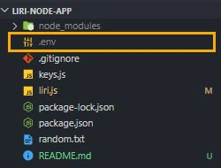
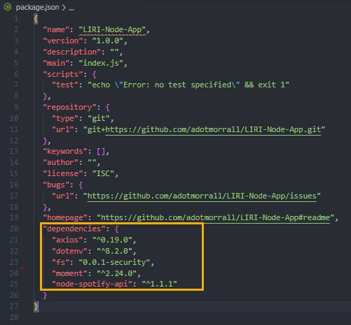
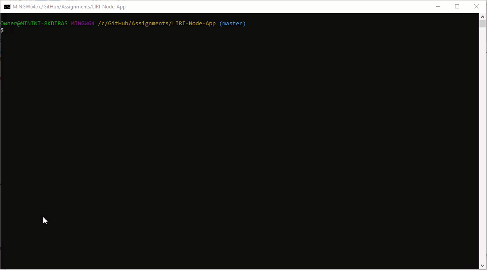
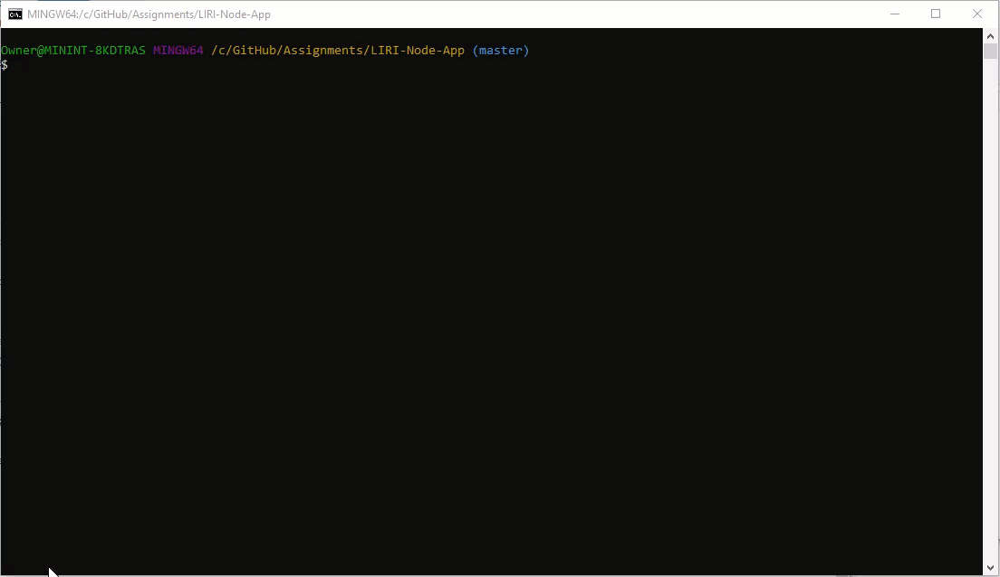

# LIRI

You've heard of SIRI; well, here's LIRI (Language Interpretation and Recognition Interface.) Use LIRI to search for your favorite bands and artists, songs, and movies.

## Before You Begin
LIRI is a command line node application. To retrieve the data that will power this app, you'll need to send requests using the following node packages and API's:

* APIs: [Node-Spotify-API](https://www.npmjs.com/package/node-spotify-api), [OMDB API](http://www.omdbapi.com), [Bands In Town API](http://www.artists.bandsintown.com/bandsintown-api)

* NPM Packages: [Axios](https://www.npmjs.com/package/axios), [Moment](https://www.npmjs.com/package/moment), [DotEnv](https://www.npmjs.com/package/dotenv)

## Instructions

1. Refer to the [Spotify](https://developer.spotify.com/documentation/web-api/quick-start/), [OMDb](http://www.omdbapi.com/apikey.aspx), and [Bands In Town](https://www.artists.bandsintown.com/support/api-installation) web pages to obtain a web API key to use LIRI.

2. Clone this repository [LIRI-Node-App](git@github.com:adotmorrall/LIRI-Node-App.git)

    **Important:** Once you get your Spotify API key, create a file named ```.env```.

    
    
    Add the following to it, and replace the ```SPOTIFY_ID``` and ```SPOTIFY_SECRET``` values with your API keys (***no quotes***), once you have them:

    ```js
    # Spotify API keys

    SPOTIFY_ID="your-spotify-id"
    SPOTIFY_SECRET="your-spotify-secret"

    ```
3. Install all the required NPM packages.

    ```js
    npm install axios
    npm install dotenv
    npm install moment
    npm install node-spotify-api
    npm install fs
    ```
4. Open your ```package.json``` file, and make sure the package names shows underneath the dependencies.

    

## How to Use LIRI

Now that the under the hood work is complete, let's show you how to use LIRI!

LIRI uses the following commands:

- ```spotify-this-song```
- ```movie-this```
- ```concert-this```
- ```do-what-it-says```

### Spotify This Song
`node liri.js spotify-this-song '<song name here>'`

Type in song name, and you will see the following information
- Artist(s)
- The song's name
- A preview link of the song from Spotify
- The album that the song is from

If no song is provided, the application will output data for, "The Sign" by Ace of Base.

**Demo**


### Movie This
`node liri.js movie-this '<movie name here>'`

Type in movie name, and you will see the following information

* Title of the movie.
* Year the movie came out.
* IMDB Rating of the movie.
* Rotten Tomatoes Rating of the movie.
* Country where the movie was produced.
* Language of the movie.
* Plot of the movie.
* Actors in the movie.

If no movie is provided, the application will output data for, "Mr. Nobody."

**Demo**



### Concert This
`node liri.js concert-this <artist/band name here>`

Type in a band or artist, and you will see the following information

- Name of the venue
- Venue location
- Date of the Event

If no movie is provided, the application will output data for, "Mr. Nobody."

**Demo**


### Do What It Says
`node liri.js do-what-it-says`

Using the `fs` Node package, LIRI will take the text inside of random.txt and then use it to call one of LIRI's commands.

- It should run `spotify-this-song` for "I Want it That Way," as follows the text in `random.txt`.

**Demo**



### Technologies:
* Node.js
* JavaScript


